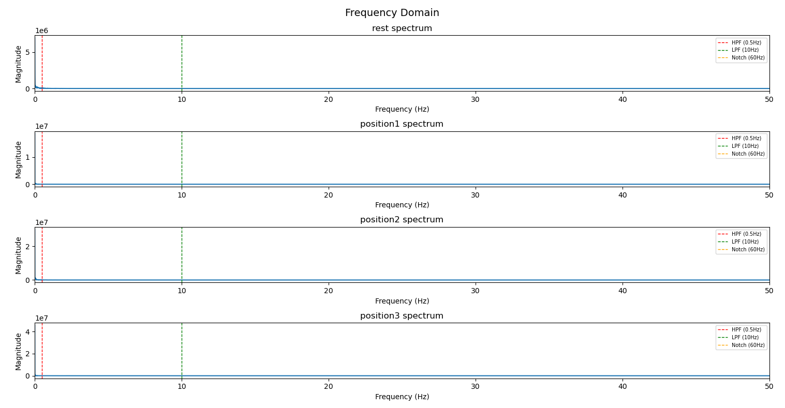
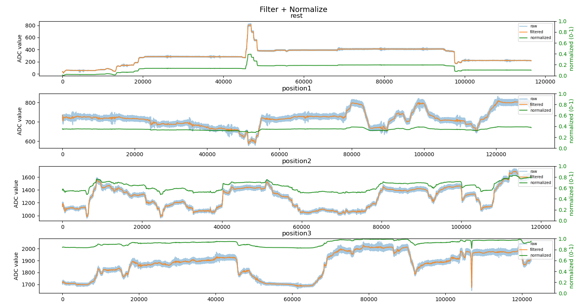
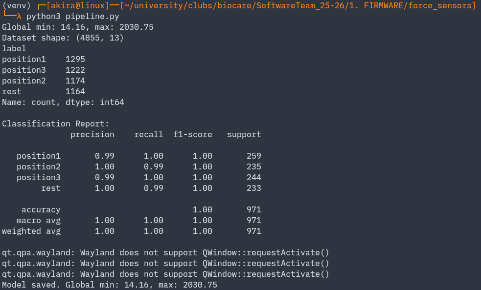
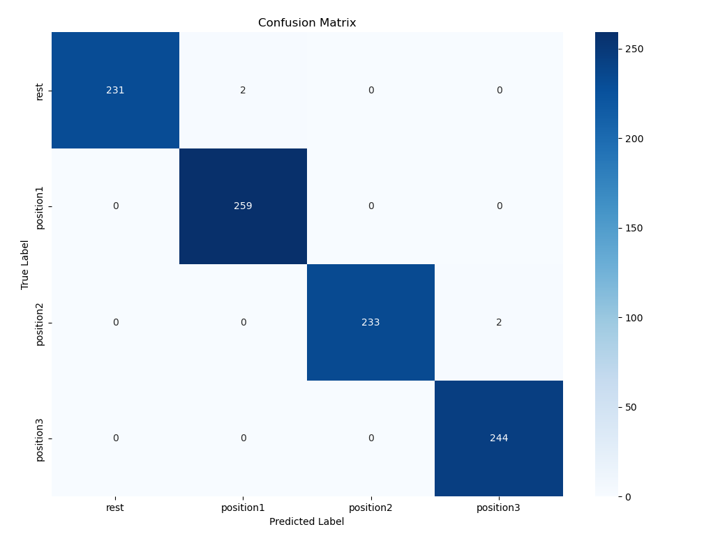
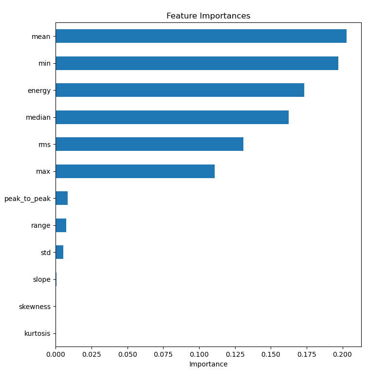

# Force Sensor Gesture Classification Pipeline

This is a proof of concept of a real-time gesture classification pipeline using force sensors.
It was built on an ESP32 using an LDR sensor as a substitute for the force sensors. This pipeline
captures, filters, and classifies hand gesture signals into discrete positions using a
Random Forest classifier.

## Pipeline Overview

| Phase | Script | Description |
|---|---|---|
| 1 | `logger.py` | Streams ESP32 serial data to labeled CSV files at 200Hz (200 samples per second) |
| 2 | `data_analysis.py` | EDA and FFT spectrum analysis to inform filter design |
| 3 | `pipeline.py` | 4th order Butterworth lowpass filter at 10Hz with global normalization |
| - | - | Sliding window feature extraction |
| - | - | Random Forest classifier training and model export |
| 4 | `live_inference.py` | Real-time inference on live serial data |

## Frequency Domain

FFT spectrum for each gesture class. All signal energy is concentrated below 2Hz,
justifying the 10Hz lowpass cutoff. The lowpass filter is needed to cut off any 
potential electrical noise from the ESP32.

## Data Normalization

Raw ADC signal data (blue), Butterworth filtered data (orange), and globally normalized data 
(green) for each gesture class. The normalized signal shows each class mapped to a consistent 
0-1 range using global min/max across all sessions, ensuring the classifier sees the same 
scale during both training and live inference.

## Gesture classification

Terminal output of a full pipeline run. 4855 windows were extracted across 4 balanced
classes. The classifier achieved overall 100% accuracy (f1-score) on the held-out 
test set, reflecting that the 4 gesture classes occupy non-overlapping ADC amplitude 
ranges with the LDR substitute sensor.

Classification results on the held-out 20% test set. Rows are true labels,
columns are predicted labels. The near-perfect diagonal with only 4 total off-diagonal
misclassifications confirms the model distinguishes all 4 gesture classes correctly.
With real force sensors, overlapping signal ranges between similar gestures will produce
more off-diagonal counts, making this matrix more useful for diagnosing which gesture
pairs need better training data.

## Feature extraction

This graph shows the contribution of each of the 12 extracted features to the Random 
Forest's decisions. Mean, min, energy, median, and RMS account for over 90% of total 
importance, meaning the classifier is distinguishing gestures almost entirely by their 
amplitude level. Slope, skewness, and kurtosis contribute near zero because the LDR 
signal is too slow and steady to produce meaningful shape variation between windows. 
These shape based features are expected to become significant with real force sensors, 
where muscle contraction signals have faster transients and asymmetric window shapes.

## Notes

- `gesture_classifier.pkl` is generated by `pipeline.py` and should not be manually edited.
- The `qt.qpa.wayland` warnings in terminal output are harmless Linux display environment messages.
- CSV data must be recollected when switching from LDR to real force sensors to retrain the model.
